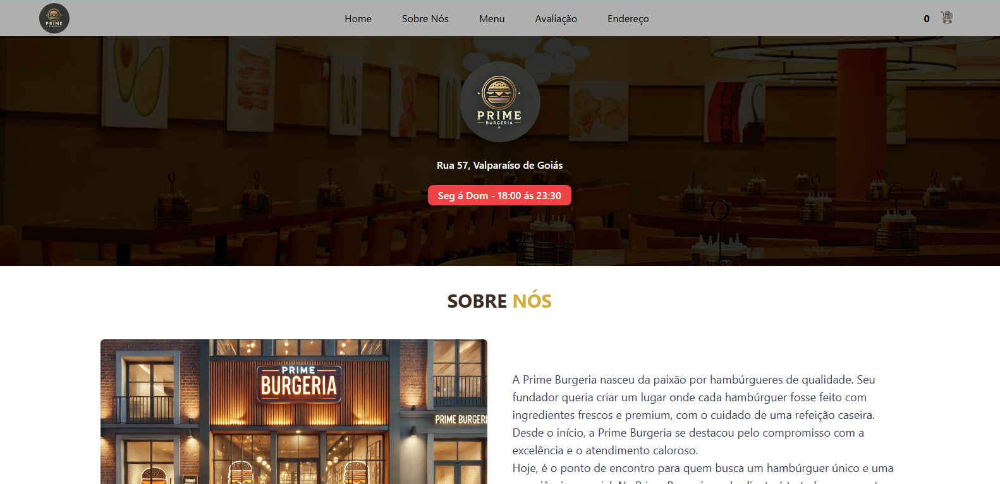

## 🍔 Prime Burgeria
Bem-vindo à Prime Burgeria! Esse projeto traz toda a praticidade para quem ama hambúrgueres de qualidade.  Agora você pode fazer seu pedido diretamente pelo site e finalizar pelo WhatsApp — tudo pensado para ser rápido e fácil!

## 🌐 Acesse o Site
Confira o site da nossa hamburgueria: [Prime Burgeria](https://primeburgeria.netlify.app/)

## 📖 Sobre o Projeto
A Prime Burgeria foi criada para quem busca um hambúrguer feito com ingredientes frescos e premium.  O site permite que o cliente faça o pedido com facilidade e seja redirecionado para o WhatsApp da loja, onde a equipe estará pronta para atender.

## ⚙️ Funcionalidades
Sistema de Pedidos: Cada produto tem sua lógica de programação, para uma experiência mais personalizada. 
Integração com WhatsApp: O cliente finaliza o pedido direto pelo WhatsApp, agilizando a comunicação. 
Design Responsivo: Compatível com dispositivos móveis, para que o pedido possa ser feito de onde for mais conveniente. 
## 🚀 Tecnologias Usadas
HTML & CSS: Estrutura e estilo do site, para uma apresentação atrativa. 
JavaScript: Implementação da lógica dos pedidos. 
TailwindCSS: Estilização rápida e eficiente dos componentes. 
Netlify: Hospedagem confiável, garantindo um site estável e rápido. 

## 🎯 Como Fazer um Pedido
Acesse o site Prime Burgeria. 
Navegue pelo menu e escolha seus itens preferidos. 
Ao finalizar, clique para enviar seu pedido para o WhatsApp. 
Confirme com a equipe e aguarde para saborear! 
## 📞 Contato
Para qualquer sugestão ou feedback, fale conosco pelo WhatsApp diretamente no site!
